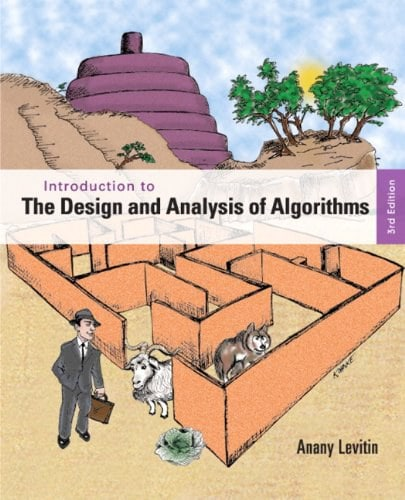
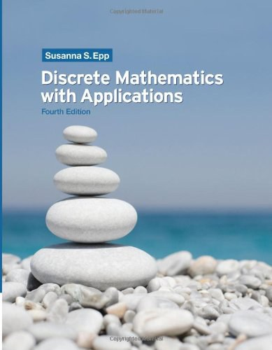

# Algorithm And Discrete Mathematics

> hello, I'm <a href="https://maxyoung.fun/">Max Young</a>

Here are some of my reading notes on algorithm learning about following two books:
<The Design and Analysis of Algorithm>, and <Discrete Mathematics with Applications>

