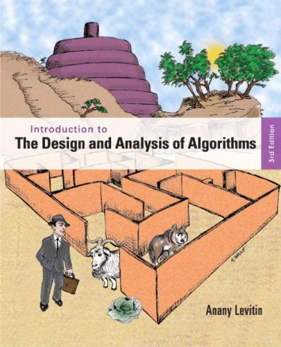

这里我在学习[Introduction to the Design and Analysis of Algorithms](https://book.douban.com/subject/6853975/)这本书的笔记和练习.

笔记用[docsify](https://docsify.js.org/)进行了部署, 地址是: <https://max-young.github.io/algorithm/>

代码由C++实现, 代码按章节组织