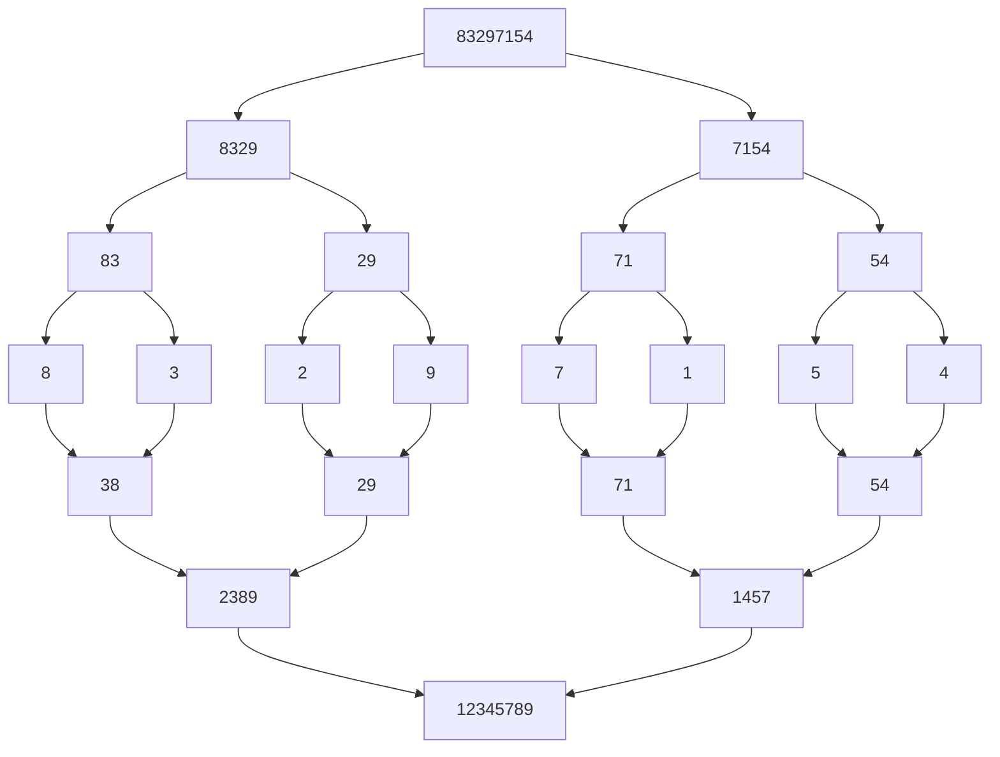

The algorithm has $\log n$ levels because at each level, the array is split into two subarrays.  
Each level requires $n$ operations in total, as every element must be compared regardless of how many subarrays exist at that level.  
Therefore, the overall time complexity is $O(n \log n)$.

Considering the graph above, the array length is 8, and it is split across 3 levels. During the merge process at each level, the number of merge operations varies, but the total number of comparisons remains 8.  
Notice that the progress is a loop not a cascade.
