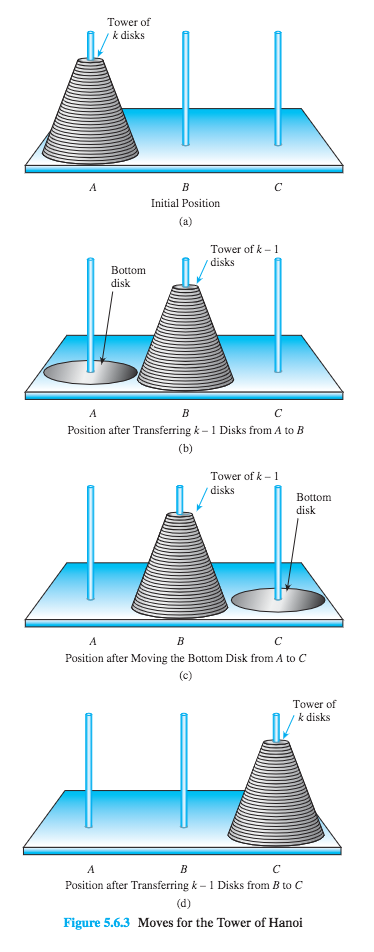

<!-- TOC -->

- [_5.1 Sequences](#_51-sequences)
  - [sequence的定义](#sequence的定义)
  - [Summation Notation](#summation-notation)
  - [Product Notaion](#product-notaion)
  - [Properties of Summations and Products](#properties-of-summations-and-products)
  - [Factorial and "n choose r" Notation](#factorial-and-n-choose-r-notation)
  - [Sequence in computer programming](#sequence-in-computer-programming)
  - [Application: Algorithm to Convert from Base 10 to Base 2 Using Repeated Division by 2](#application-algorithm-to-convert-from-base-10-to-base-2-using-repeated-division-by-2)
- [_5.2 Mathematical Induction 1](#_52-mathematical-induction-1)
  - [定义](#定义)
- [_5.5 Application: Correctness of Algorithms](#_55-application-correctness-of-algorithms)
- [_5.6 Defining Sequence Recursively](#_56-defining-sequence-recursively)
  - [Definition](#definition)
  - [Examples of Recursively Defined Sequences](#examples-of-recursively-defined-sequences)
- [_5.7 Solving Recurrence Relations by Iteration](#_57-solving-recurrence-relations-by-iteration)
  - [The Method of Iteration迭代方法](#the-method-of-iteration迭代方法)
  - [Using Formulas to Simplify Solutions Obtained by Iteration](#using-formulas-to-simplify-solutions-obtained-by-iteration)
- [_5.8 Second-Order Linear Homogeneous Recurrence Relations with Constant Coefficients](#_58-second-order-linear-homogeneous-recurrence-relations-with-constant-coefficients)
  - [The Distinct-Roots Case](#the-distinct-roots-case)
  - [The Single-Root Case](#the-single-root-case)
- [_5.9 General Recursive Definitions and Structural Induction](#_59-general-recursive-definitions-and-structural-induction)

<!-- /TOC -->

Chapter5 SEQUENCES, MATHMATICAL INDUCTION, AND RECURSION

数学的一项重要任务是发现和描述一些常规模式, 比如一些重复的过程.  
重复过程可以用一个数学构造Sequence来表示, 验证sequence的数学猜想的主要工具是mathematical induction数学归纳法  

<a id="markdown-_51-sequences" name="_51-sequences"></a>
### _5.1 Sequences

#### sequence的定义

sequence的定义有一些奇怪:  
**sequence** is a function whose domain is either all the integers between two given integers or all the integers greater than or equal to a given integer.

可以这么理解:
function的domain就是下标(subscript or index), sequence里的值(term)就是function的co-domain, term的值都和sequence的下标相关联  
"between two given integer"表示这个sequence是有限的, 这是一个infunite sequence  
"all the integers greater than a given integer"表示这个sequence是无限的  
"all the integers equal to a given integer"表示这个sequence的长度是1

#### Summation Notation

有这样的一个sequence, $A_k = 2^k$, 我们要求前六个term的求和:

$$A_1 + A_2 + A_3 + A_4 + A_5 + A_6 = 2^1 + 2^2 + 2^3 + 2^4 + 2^5 + 2^6 = 126$$

有没有更简单的表示呢?

if m and n are integers and $m\leq n$, the symbol $\sum\limits_{k=m}^{n} a_k$, read the summation from k equals m to n of a-sub-k, is the sum of all the terms $a_m, a_{m+1}, a_{m+2}, ..., a_n$. we say that $a_m + a_{m+1} + a_{m+2} + ... + a_n$ is the expand form of the sum, and we write:

$$\sum\limits_{k=m}^na_k = a_m + a_{m+1} + a+{m+2} + ... + a_n$$

we call k the index of the summation, m the lower limit of the summation, and n the upper limit of the summation.

#### Product Notaion

if m and n are integers and $m\leq n$, the symbol $\prod\limits_{k=m}^n a_k$(注释: 此处latex limits不起作用), read the product from k equals m to n of a-sub-k, is the product if all terms $a_m, a_{m+1, a_{m+2}, ... , a_n}$, we write:

$$\prod\limits_{k=m}^n a_k = a_m.a_{m+1}.a_{m+2}...a_n $$

#### Properties of Summations and Products

if $a_m, a_{m+1}, a_{m+2}, ...$ and $b_m, b_{m+1}, b_{m+2}, ...$ are sequemces of real numbers and c is any real number, then the following equations hold for any integer $n\geq m$:

1. $\sum\limits_{k=m}^n a_k + \sum\limits_{k=m}^n b^k = \sum\limits_{k=m}^n (a_k+b_k)$
2. $c.\sum\limits_{k=m}^n a_k = \sum\limits_{k=m}^n c.a_k$
3. $\left( \prod\limits_{k=m}^n a_k \right) .\left(\prod\limits_{k=m}^n b_k\right) = \prod\limits_{k=m}^n (a_k.b_k)$

#### Factorial and "n choose r" Notation

for each positive integer n , the quantity a factorial denoted $n!$, is defined to be the product of all the integers fro 1 to n:

$$n! = a.(n-1)...3.2.1$$

Zero factorial, denoted 0!, is defined to be 1:

$$0! = 1$$

Let n and r be integers with $0\leq r \leq n$. the symbol

$${n \choose r}$$

is read "n choose r" and represents the number of subsets of size r that can be chosen from a set with n elements.

fro all integers n and r with $0\leq r \leq n$

$${n \choose r} = \frac{n!}{r!(n-r)!} $$

#### Sequence in computer programming

计算机里用到的最多的是一位数组one-dimensional array

#### Application: Algorithm to Convert from Base 10 to Base 2 Using Repeated Division by 2

$$
38 = 19.2 + 0 \\
19 = 9.2 + 1 \\
9 = 4.2 + 1 \\
4 = 2.2 + 0 \\
2 = 1.2 + 0 \\
1 = 0.2 + 1
$$

$$
38 = 19·2+0 \\
= (9·2+1)·2+0 \\
= 9·2^2 +1·2+0 \\
= (4·2+1)·2^2 +1·2+0 \\
= 4·2^3 +1·2^2 +1·2+0 \\
= (2·2+0)·2^3 +1·2^2 +1·2+0 \\
= 2·2^4 +0·2^3 +1·2^2 +1·2+0 \\
= (1·2+0)·2^4 +0·2^3 +1·2^2 +1·2+0 \\
= 1·2^5 +0·2^4 +0·2^3 +1·2^2 +1·2+0.
$$

​	$$a_{10} = (r[k]r[k-1]...r[2]r[1])_2$$

```
Algorithm Decimal to Binary Conversion Using Repeated Division by 2
Input: n[a nonnegtive integer]
Algorithm Body:
q = n, i = 0
q一直除以2知道q变成0, 存储remainder余数到一个一维数组
while(i = 0 or q != 0)
  r[i] = q mod 2
  q = q div 2
  i = i + 1
end while 
Ouptput: r[0], r[1], ..., r[i-1]
```

### _5.2 Mathematical Induction 1

> Mathemetical induction is the standard proof technique in computer science. -- Anthony Ralston, 1984

#### 定义

数学归纳法的重要性不言而喻. 看看下面的例子:  
在美国, 有人认为1便士没有必要存在了, 8便士以上的价格都可以用3便士和5便士来兑换. 我们可以列举几个:
$$
\begin{aligned}
8 &= 3 + 5 \\
9 &= 3 + 3 + 3 \\
10 &= 5 + 5 \\
11 &= 3 + 3 + 5\\
...
\end{aligned}
$$
那么是否可以一直这么算下去呢?  
我们可以考虑这样的一个问题: 假如k便士可以被3便士和5便士换算, 那么k+1便士是否可以呢? 我们试着证明一下:  
假如k便士换算里, 有一个5便士, 那么我们把5便士拿掉, 换成两个3便士, 那么就变成k+1便士了, k+1就能被3和5换算.  
假如k便士里没有5便士, 只有3便士呢? k = 8时是成立的, 先不用考虑, 从k = 9开始, 如果k只能被3换算, 那么必须有3个3便士以上, 那么我们把3个便士拿掉, 换成2个5便士, 就变成k+1个便士了, k+1也就能被3和5换算.  
这样, 上面的换算假设里, 初始值k = 8时是成立的, 另外如果 k >= 8 时是成立的, 那么k + 1也成立, 那么是否说明上面的假设就是成立的呢?  
这个问题很好的描述了mathematical induction:  
> Principle of Mathematical Induction  
> $P(n)$表示和整数n相关的一个特性, a是一个特定的整数, 如果下面的两个条件为真:  
> 
> 1. P(a) is true  
> 2. 对于所有的整数$k \ge a$, 如果P(k) is true, 那么P(k+1) is true  
> 
> 那么我们说: 对于所有的整数$n \ge a$, P(n) is true 


<a id="markdown-_55-application-correctness-of-algorithms" name="_55-application-correctness-of-algorithms"></a>
### _5.5 Application: Correctness of Algorithms

In this section we given an overview of the general format of correctness proofs and the details of one crucial technique, the *loop invariant procedure*

- Assertions

  Often the predicate describing the initial state is called **pre-condition for the algorithm**, and the predicate describing the final state is called the **post-condition for the algorithm**

  Example:

  Algorithm to compute a product if nonnegtive integers

  *Pre-condition*: The input variables *m* and *n* are nonnegative integers

  *Post-condition*: The output variable *p* equals m.n

- Loop invariants

  非常严谨的证明loop的方法, 无法描述, 看书吧

### _5.6 Defining Sequence Recursively

#### Definition

定义一个sequence有多种方法:
- 一种非正式的方法
  列举出开始几个元素, 并期待这几个元素能表示出这个sequence的特征, 但是往往这个是不奏效的, 比如: "有这样一个sequence: 3, 5, 7...", 接下来的元素是什么呢? 可能是9, 都是奇数, 也有可能是11, 都是素数
- 用公式表达  
  例如我们可以用$a_n = \frac{(-1)^n}{n + 1}$ for all integers $n \ge 0$  
  这种表达非常清晰, 这个sequence的term只和下标有关系

还有一种方法就是本章要讲的: 递归  
这种方法需要用到recurrence relation, 它是指用前面的term来定义后面的term, 并且需要定义一个或者多个初始term

正式的定义是:  
> 一个sequence $a_0, a_1, a_2, ...$, 其**recurrence relation**是一个公式, 这个公式定义了这个sequence的一个term $a_k$和其之前的term的关系: $a_{k-1}, a_{k-2}, ..., a_{k-i}$, $k - i \ge 0$  
> 初始条件**initial conditions**是指, i如果是一个确定的整数, 那么要给$a_0, a_1, a_2, ..., a_{i-1}$指定初始值, 因为根据recurrence relation, $a_i$的值由$a_0, a_1, a_2, ..., a_{i-1}$来确定  
> 如果i不确定, i的值由k来决定, 那么只需初始化根据实际情况需要的值就可以: $a_0, a_1, ..., a_m$, $m \ge 0$, m根据实际情况来定

#### Examples of Recursively Defined Sequences

递归recursion是计算机科学的重要思想之一.  
解决递归问题最重要的是把问题拆解成一个小的子问题, 这个子问题足够容易解答, 这个大的递归问题是这个子问题的重复执行.
解决递归的问题的难度也在于此: 找到这个子问题, 并把这个子问题作为源问题来解决整个递归问题.  
如果子问题能得到解决, 我们称之为递归信念飞跃(recursive leap of faith), 呵呵呵

- **The Tower of Hanoi**

  经典问题, 有3根柱子A、B、C, A上面套有64个盘子, 大小不一, 从下到上依次从大到小摆放, 要把这64个盘子从A柱挪到C柱, 一次只能挪一个, 且大盘子不能放在小盘子上面. 请问需要挪多少次才能完成?  
  法国科学家卢卡斯在19世纪时将这个问题刊登在杂志上, 并悬赏求解答. 印度神话里也有这样的一个故事, 说某个神话人物终日不息要完成这样工作, 完成的那一天就是世界的末日.

  这个问题可以用递归来解决, 书里说的很详细, 一步一步推理, 而不是因为“显而易见”而跳跃, 对逻辑思考和对递归的理解大有裨益.  
  要讲k个盘子从A挪到C, 需要先讲上面的k-1个盘子从A柱挪到B柱, 再将最大的盘子从A柱挪到C柱, 再将k-1个盘子从B柱挪到C柱, 这样就完成了.  
  这是最少的挪动次数, 因为只有两种选择, 除了这种选择, 还有一种就是将k-1个盘子从A柱挪到C柱, 再将最大的盘子从A柱挪到B柱, 再将k-1个盘子从C柱挪到A柱, 再将最大的盘子从B柱挪到C柱, 最后将k-1盘子从A柱挪到C柱, 很显然步骤增多了.  
  我们用图来表示上面的挪动方法:  
    
  所以:  
  $$[将k个盘子从A挪到C的挪动次数] = [从(a)到(b)的挪动次数] + [从(b)到(c)的挪动次数] + [从(c)到(d)的挪动次数]$$
  我们将$m_k$表示为将k个盘子从一个柱子挪到另外一个柱子的操作次数  
  上面的等式里, 从(a)到(b)的挪动次数和从(c)到(d)的挪动次数是一样的, 都是将k-1个盘子从一个柱子挪到另外一个柱子, 尽管最大的那个盘子位置不一样, 但是最大的盘子是不动的, 不影响挪动的次数  
  从(b)到(c)就是将最大的盘子挪动一次  
  所以, 上面的等式可以转换为:
  $$m_k = m_{k-1} + 1 + m_{k-1} if k > 1$$
  上面我们加了一个限定条件$k > 1$, 因为只有盘子是2个和2个以上时才适用于这种情况. 这就是recurrence relation.  
  我们还需要一个init conditions, 这里只需要定义k = 1的情况就可以了, 显然$m_1 = 1$  
  这样, $m_1, m_2, m_3, ...$的完整的recursively define就是:
  $$
  \begin{aligned}
  m_k &= 2m_{k-1} + 1\\
  m_1 &= 1
  \end{aligned}
  $$
  这就是完整清晰的recursively define

  后续: 在计算机上计算出挪动64个盘子的操作次数, 算出来是$1.844674 \times 10^19$, 非常惊人的数字

<a id="markdown-_57-solving-recurrence-relations-by-iteration" name="_57-solving-recurrence-relations-by-iteration"></a>
### _5.7 Solving Recurrence Relations by Iteration

在上一章节里, recurrence relation表示了一个term和其前面的term之间的关系, 这意味着我要计算某一个term时, 就需要将其前面的term先算出来, 当这个term的下标很大时, 计算量就很大了.  
有没有办法将recurrence relation转换为只和下标相关的等式呢?  

#### The Method of Iteration迭代方法

这个方法就是根据recurrence relation和initial conditions计算出几个term, 直到发现其规律

- **Arithmetic Sequence**

  有这样一个sequence: $a_0, a_1, a_2, ...$, 是这样定义的:  
  k是大于等于1的整数  
  $$
  \begin{aligned}
  a_k &= a_{k-1} + 2 \\
  a_0 &= 1
  \end{aligned}
  $$
  我们计算几个term看看:
  $$
  \begin{aligned}
  a_0 &= 1 = 1 + 0 \cdot 2\\
  a_1 &= 1 + 2 = 1 + 1 \cdot 2 \\
  a_2 &= 1 + 2 + 2 = 1 + 2 \cdot 2 \\
  a_3 &= 1 + 2 + 2 + 2 = 1 + 3 \cdot 2 \\
  a_4 &= 1 + 2 + 2 + 2 + 2 = 1 + 4 \cdot 2 \\
  a_5 &= 1 + 2 + 2 + 2 + 2 + 2 = 1 + 5 \cdot 2 \\
  ...
  \end{aligned}
  $$
  我们可以猜想: $a_k = 1 + n \cdot 2 = 1 + 2n$  
  当然这只是一个猜想, 本章会有数学归纳法来证明  
  这种sequence称为**arithmetic sequence**, 正式的定义是:  
  > 如果一个sequence: $a_0, a_1, a_2, ...$称之为arithmetics sequence, 那么它必须满足:
  > $$a_k = a_{k-1} + d\ for\ all\ integers\ k \ge 1$$
  > 那么:
  > $$a_n = a_0 + dn\ for\ all\ integers\ n \ge 0$$

- **Geoetric Sequence**

  这样的一个sequence:
  $$
  \begin{aligned}
  a_k = ra_{k-1}\ for\ all\ integers\ k \ge 1 \\
  a_0 = a
  \end{aligned}
  $$
  计算几个term看看:
  $$
  \begin{aligned}
  a_0 &= a \\
  a_1 &= ra_0 = ra \\
  a_2 &= ra_1 = r^2a \\
  a_3 &= ra_2 = r^3a \\
  ...
  \end{aligned}
  $$
  我们可以猜想: $a_n = ar^n$ for all integers $n \ge 0$
  这种sequence称为**geometric sequence**, 正式的定义是:  
  > 如果一个sequence: $a_0, a_1, a_2, ...$称之为arithmetics sequence, 那么它必须满足:
  > $$a_k = ra_{k-1}\ for\ all\ integers\ k \ge 1$$
  > 那么:
  > $$a_n = a_0r^n\ for\ all\ integers\ n \ge 0$$

#### Using Formulas to Simplify Solutions Obtained by Iteration

我们用上面的两个定理来解决两个常见的问题  

- **An Explicit Formula for the Tower of Hanoi Sequence**

在5.6章节里, Tower of Hanoi Sequence可以这么定义:
$$
m_k = 2m_{k-1} + 1\ for\ all\ integers\ k \ge 2 \\
m_1 = 1
$$


<a id="markdown-_58-second-order-linear-homogeneous-recurrence-relations-with-constant-coeffcients" name="_58-second-order-linear-homogeneous-recurrence-relations-with-constant-coeffcients"></a>
### _5.8 Second-Order Linear Homogeneous Recurrence Relations with Constant Coefficients

标题直译过来是: 具有常数系数的二阶线性齐次递归关系. recurrence relations参照5.7章节  
为递归定义的sequence找到明确的公式很难, 这一张讲这样的方法.

> a second-order linear homogeneous recurrence relation with constant coefficients是一个这种形式的recurrence relation:  
>                    $a_k = Aa_{k-1} + Ba_{k-2}$ for all integers $k \ge$ some fixed integers  
> A and B are fixed real numbers with $B \ne 0$
> second-order是指有$a_{k-1}$和$a_{k-2}$两个term, linear是指两个term的指数都是1, 所以是线性的, homogeneous也是指两个term的degree(指数)是一样的, const coefficients是指A和B是常数

#### The Distinct-Roots Case

有这样的一个recurrence relation:
$$a_k = Aa_{k-1} + Ba_{k-2}$$
什么样的sequence满足这个recurrence relation呢?  
很显然的一种情况是: 所有$a_i= 0$的sequence满足.  

还有另外一种情况:
$$1, t, t^2, t^3, ..., t^n, ...$$
这个sequence是否满足呢? 如果满足的话, 那么下面的等式应该是成立的:
$$t^k = At^{k-1} + Bt^{k-2}$$
如果$k = 2$时:
$$t^2 = At + B$$
$$t^2 - At - B = 0$$
这是一个二次方程式, 是成立的. 那么对于k等于其他数字的情况呢, 我们对上面的式子乘以$t^{k-2}$:
$$t^{k-2}t^2 - At^{k-2}t - Bt^{k-2} = 0$$
$$t^k = At^{k-1}t + Bt^{k-2}$$
所以, 我们有这样的定理:
> A和B是real number, 一个recurrence relation:
> $a_k = Aa_{k-1} + Ba_{k-2}$ for all integers $k \ge 2$  
> 它适用于这样的sequence:
> $$1, t, t^2, t^3, ..., t^n, ...$$
> t不是0, t满足这样的等式:
> $$t^2 - At - B = 0$$

举一个例子:  
这样的一个recurrence relation:
$$a_k = a_{k-1} + 2a_{k-2}$$
根据上面的定理:
$$t^2 = t + 2$$
算出来$t = -1$或者$t = 2$  
所以下面的两个sequence满足此recurrence relation:  
$1, -1, 1, -1, ..., (-1)^n, ...$和$1, 2, 4, 8, ..., 2^n, ...$

另外一个定理:  
> 有两个sequence: $r_0, r_1, ...$和$s_0, s_1, ...$满足second-order linear homogeneous recurrence relation  
> 那么另外一个sequence: $a_0, a_1, ...$, 它被这样定义:
> $$a_n = Cr_n + Ds_n$$
> 这个sequence也满足和r、s一样的second-order linear homogeneous recurrence relation

证明一下:  
如果a sequence满足second-order linear homogeneous recurrence relation, 那么:  
$$
\begin{aligned}
a_k &= Aa_{k-1} + Ba_{k-2} \\
Cr_k + Ds_k &= A(Cr_{k-1} + Ds_{k-1}) + B(Cr_{k-2} + Ds_{k-2}) \\
Cr_k + Ds_k &= ACr_{k-1} + ADs_{k-1}) + BCr_{k-2} + BDs_{k-2}) \\
Cr_k + Ds_k &= C(Ar_{k-1} + Br_{k-2}) + D(As_{k-1} + Bs_{k-2}) \\
Cr_k + Ds_k &= Cr_k + Ds_k \\
\end{aligned}
$$
证明完成

有了这样的定理, 我们就可以解决recurrence relation加上initial condition的问题了  
假设recurrence relations是:  
$a_k = Aa_{k-1} + Ba_{k-2}$ for all integers $k \ge 2$  
initial conditions是:  
$a_0 = 1$ and $a_1 = 8$  
找到满足这两个条件的sequence  
满足recurrence relations的两个sequence是$1, -1, 1, -1, ..., (-1)^n, ...$和$1, 2, 4, 8, ..., 2^n, ...$  
所以: $a_n = C \cdot 2^n + D \cdot (-1)^n$  
根据initial conditions, 得到:
$$
\begin{aligned}
a_0 &= 1 = C + D \\
a_1 &= 8 = 2C - D
\end{aligned}
$$
从而计算得到$C = 3, D = -2$, 从而:
$$a_n = 3 \cdot 2^n - 2 \cdot (-1)^n$$

**Fibonacchi Sequence**

很熟悉对不对, 根据上面的定理, 我们来解决Fibonacchi sequence, 这个数列的定义是:  
recurrence relation是:
$$F_k = F_{k-1} + F_{k-2}$$
initial conditions是:
$$ F_0 = F_1 = 1$$
我们计算一下:  
$$
\begin{aligned}
&t^2 = t + 1 \\
&t = \frac{1+\sqrt{5}}{2}\ or\ t = \frac{1-\sqrt{5}}{2} \\
&F_0 = 1 = C + D\\
&F_1 = 1 = C \cdot \frac{1+\sqrt{5}}{2} + D \cdot \frac{1-\sqrt{5}}{2} \\
&C = \frac{1 + \sqrt{5}}{2\sqrt{5}} \\
&D = \frac{-(1 - \sqrt{5})}{2\sqrt{5}} \\
&F_n = C \cdot {\left(\frac{1+\sqrt{5}}{2}\right)}^n + D \cdot {\left(\frac{1-\sqrt{5}}{2}\right)}^n \\
&F_n = \frac{1 + \sqrt{5}}{2\sqrt{5}} \cdot {\left(\frac{1+\sqrt{5}}{2}\right)}^n + \frac{-(1 - \sqrt{5})}{2\sqrt{5}} \cdot {\left(\frac{1-\sqrt{5}}{2}\right)}^n \\
&F_n = \frac{1}{\sqrt{5}} \cdot {\left(\frac{1+\sqrt{5}}{2}\right)}^{n+1} - \frac{1}{\sqrt{5}} \cdot {\left(\frac{1-\sqrt{5}}{2}\right)}^{n+1}
\end{aligned}
$$

#### The Single-Root Case

上面提到了distinct-root case, $t^2 - At - B = 0$, 这个二次方程式有两个解, 得出有两个sequence满足second-order linear homogeneous recurrence relation  
假如这个二次方程正好有一个解r呢? 是不是只有一个sequence: $1, r, r^2, ...$满足呢?  
先贤们提出还有一个sequence满足: $0, r, 2r^2, 3r^3, ..., nr^n, ...$  
用公式定义就是: $s_n = nr^n$ for $n \ge 0$
我们来证明一下
$$
\begin{aligned}
t^2 - At - B = {(t - r)}^2 = t^2 - 2rt + r^2 = 0 \\
A = 2r \\
B = - r^2 \\
\end{aligned}
$$
假设s满足上面的recurrence relation, 那么:
$$
\begin{aligned}
s_n &= As_{n-1} + Bs_{n-2} \\
nr^2 &= A(n-1)r^{n-1} + B(n-2)s_{n-2} \\
&= 2r(n-1)r^{n-1} - r^2(n-2)s_{n-2} \\
&= 2(n-1)r^n - (n-2)s_n \\
&= nr^n\\
\end{aligned}
$$
证明完成

我们在根据distinct-root case里的定理, 下面公式定义的sequence也满足$a_k = Aa_{k-1} + Ba_{k-2}$的recurrence relation:
$$a_n = Cr^n + Dnr^n$$

我们再根据这个定理来解答包括initial conditions的情况: 
recurrence relation是: $b_k = 4b_{k-1} - 4b_{k-2}$  
initial conditions是: $b_0 = 1, b_1 = 3$  
recurrence relation满足single-root case的情况:  
$t^2 - 4t + 4 = 0$, 得出$r = 2$  
再计算C和D
$$
\begin{aligned}
b_0 = 1 &= Cr^0 + D\cdot 0\cdot r^0 \\
&= C2^0 + D\cdot 0\cdot 2^0 \\
&= C
\end{aligned}
$$
得出$C = 1$  
$$
\begin{aligned}
b_1 = 3 &= Cr^1 + D\cdot 1\cdot r^1 \\
&= 1\cdot 2^1 + D\cdot 1\cdot 2^1 \\
&= 2 + 2D \\
\end{aligned}
$$
得出$D = \frac{1}{2}$  
所以我们得出这个sequence可以这么定义:
$$
\begin{aligned}
b_n &= Cr^n + Dnr^n \\
&= 2^n + \frac{n}{2}2^n \\
&= (1 + \frac{n}{2})2^n\ for\ all\ integers\ n \ge 0
\end{aligned}
$$

<a id="markdown-_59-general-recursive-definitions-and-structural-induction" name="_59-general-recursive-definitions-and-structural-induction"></a>
### _5.9 General Recursive Definitions and Structural Induction

- Recursively Defined Sets

  定义方法是:

  1. BASE: A statement that certain objects belong to the set
  2. RECURSION: A collection of rules indicating how to form new set objects from those already known to be the set
  3. RESTRICTION: A statement that no objects belong to the set other than those coming from 1 and 2

-  Proving Properties about Recursively Defined Sets

  structural induction可证明

- Recursive Functions