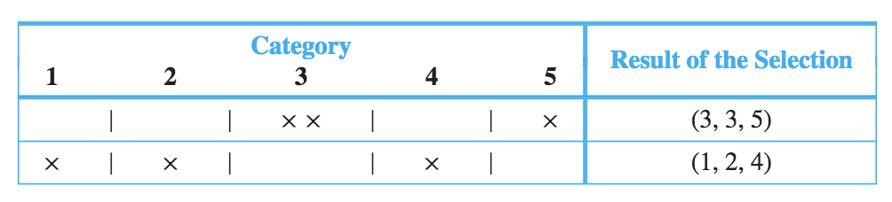

<!-- TOC -->

- [_9.1 Introduction 介绍](#_91-introduction-介绍)
- [_9.2 Possibility Trees and the Multiplication Rule](#_92-possibility-trees-and-the-multiplication-rule)
  - [Permutations](#permutations)
  - [Permutations of Selected Elements](#permutations-of-selected-elements)
- [_9.3 Counting Elements of Disjoint Sets: The Addition Rule加法法则](#_93-counting-elements-of-disjoint-sets-the-addition-rule加法法则)
- [_9.4 The Pigeonhole Principle鸽洞原理](#_94-the-pigeonhole-principle鸽洞原理)
- [_9.5 Counting subsets of a Set: Combinations](#_95-counting-subsets-of-a-set-combinations)
- [_9.6 r-combinations with Repetition Allowed](#_96-r-combinations-with-repetition-allowed)
  - [Definition](#definition)
  - [从5种饮料中选出15瓶饮料](#从5种饮料中选出15瓶饮料)
  - [Counting Triples (i, j, k)](#counting-triples-i-j-k)
  - [Counting Iteration of a Loop](#counting-iteration-of-a-loop)
- [_9.8 Probability Axioms and Expected Value](#_98-probability-axioms-and-expected-value)
  - [Probability Axioms](#probability-axioms)
  - [Expected Value](#expected-value)

<!-- /TOC -->

Chapter 9 COUNTING AND PROBABILITY 计数和概率

<a id="markdown-_91-introduction-介绍" name="_91-introduction-介绍"></a>
### _9.1 Introduction 介绍

sanple space: 样本空间

A sample space is the set of all possible outcomes of a random process or experiment.
An event is a subset of a sample space.

Equally Likely Probability Formula: 均等概率公式

<a id="markdown-_92-possibility-trees-and-the-multiplication-rule" name="_92-possibility-trees-and-the-multiplication-rule"></a>
### _9.2 Possibility Trees and the Multiplication Rule

#### Permutations

一个set的permutation是指其元素的ordering. 比如一个set的元素是a, b, c, 它有6个permutations:  
abc acb cba bac bca cab  
那么n个yuansu的set, 有多少个permutations呢? 很好算, 我们挨个排, 第一个元素有n个选择, 第二个元素有n-1个选择, 第n个元素只有1个选择, 所以我们有这样的定理:  
对于$n \ge 1$的整数n, 一个有n个元素的set, 有$n(n-1)(n-2)...1 = n!$个permutations

#### Permutations of Selected Elements

上面说的permutation是指给定set里的所有元素的排序, 假如我们从中选取一部分元素做排序, 会有多少种排序呢?  
这就是Permutations of Selected Elements的定义:

一个含有n个元素的set, 它的**r-permutations**是指从这n个元素中挑选出r个元素, 并且是有序的, 这些挑选组合的集合.  
用$P(n, r)$来表示这个几何的长度, 也就是共有多少种挑选

$P(n, r)$怎么计算呢? 跟Permutations的计算很像:  
还是挨个排, 第一个元素有n种选择, 第二个元素有n-1种选择, 第r个元素有i$n-(r-1)=n-r+1$种选择, 所以:
$$P(n, r) = n(n-1)(n-2)...(n-r+1)$$
将这个等式做一下转换:
$$\frac{n!}{(n-r)!} = \frac{n(n-1)(n-2)...(n-r+1)(n-r)(n-r-1)...1}{(n-r)(n-r-1)...1} = n(n-1)(n-2)...(n-r+1)$$
所以:
$$P(n, r) = \frac{n!}{(n-r)!}$$

<a id="markdown-_93-counting-elements-of-disjoint-sets-the-addition-rule加法法则" name="_93-counting-elements-of-disjoint-sets-the-addition-rule加法法则"></a>
### _9.3 Counting Elements of Disjoint Sets: The Addition Rule加法法则

例如, 密码是26个字母的组合, 长度是1位到3位, 那么密码的可能是1位、2位、3位三种可能性之和

<a id="markdown-_94-the-pigeonhole-principle鸽洞原理" name="_94-the-pigeonhole-principle鸽洞原理"></a>
### _9.4 The Pigeonhole Principle鸽洞原理

5只鸽子飞往4个洞, 那么至少有一个洞有2个或2个以上鸽子, 好像是显而易见的哈. 用术语表达就是:

Pigeonhole Principle:  A function from one finite set to a smaller finite set cannot be one-to-one: There must be a least two elements in the domain that have the same image in the co-domain.

<a id="markdown-_95-counting-subsets-of-a-set-combinations" name="_95-counting-subsets-of-a-set-combinations"></a>
### _9.5 Counting subsets of a Set: Combinations

一个实际的问题: 从12个人中挑出5个人组成一个team去工作, 有多少种不一样的5个人的挑法?   
这就涉及到这一章节要讲的定义: r-combination  
两个正整数r and n, $r \le n$, 有n个元素的set的**r-combination**, 是指一个subset, 它有r个元素, 这r个元素属于这n个元素, 表示为:
$$\binom{n}{r}$$
读作"n choose r", 表示从n个元素的set里挑出r个元素的subset(r-combination)的长度

举一个例子, 一个set{0, 1, 2, 3}, 从中挑出两个数字, 元素比较少, 我们手动就能算出来: $\binom{4}{2} = 6$, 手动全部列出来的方法叫**complete enumeration**穷举法  

有没有公式来计算呢? 我们回顾一下9.2章节的[Permutations of Selected Elements](#permutations-of-selected-elements), $P(n, r) = \frac{n!}{(n-r)!}$
我们可以把r-permutations的计算拆分成两步, 还是以set{0, 1, 2, 3}为例:
1. 找出{0, 1, 2, 4}的两个元素的子集
2. 对这些子集进行排序
第一步的子集的数量就是$\binom{4}{2}$, 第二步, 对于每一个子集的排序的数量, 其实就是permutations的计算方法: $2!$, 因为是每个子集都是2个元素, 所以:
$$P(4, 2) = \binom{4}{2}\cdot2!$$
所以:
$$\binom{4}{2} = \frac{P(4, 2)}{2!} = \frac{\frac{4!}{(4-2)!}}{2!} = \frac{4!}{(4-2)!2!} = 6$$

这个例子具有普遍性, 从而我们得到这样的一个定理:  
一个含有n个元素的set, 从中能挑出具有r个元素的subset(r-combinations)的数量, 记为$\binom{n}{r}$, 它具有这样的性质:
$$\binom{n}{r} = \frac{P(n, r)}{r!} = \frac{\frac{n!}{(n-r)!}}{r!} = \frac{n!}{r!(n-r)!}$$
n和r都是正整数, 且$r \le n$

### _9.6 r-combinations with Repetition Allowed

#### Definition

在上一章节介绍了r-combinations的概念, r-combinations里的元素是不重复的, 如果可以重复呢? 这就是r-combinations with repetition allowed的概念. 

还是举例子说明:  
一个set{1, 2, 3, 4}, 从中取3个元素, 它的r-combinations with repetition allowed有:  
[1,1,1];[1,1,2];[1,1,3];[1,1,4] all combinations with 1, 1  
[1,2,2];[1,2,3];[1,2,4];all additional combinations with 1, 2  
[1,3,3];[1,3,4];[1,4,4];all additional combinations with 1, 3 or 1, 4  
[2,2,2];[2,2,3];[2,2,4];all additional combinations with 2, 2  
[2,3,3];[2,3,4];[2,4,4];all additional combinations with 2, 3 or 2, 4  
[3,3,3];[3,3,4];[3,4,4];all additional combinations with 3, 3 or 3, 4  
[4,4,4]the only additional combination with 4, 4

如何计算呢? 下面的idea非常之精妙:  
我们把1,2,3,4之间加上分割符号, 1,2,3,4可以代表值为1,2,3,4的分类, 这样依次排开, 上面的穷举法里的例子就可以这样表示:  
| 1category | \|  | 2category | \|  | 3category | \|  | 4category | complete enumeration |
| ---       | --- | ---       | --- | ---       | --- | ---       | ---                  |
| ***       | *   |           | *   |           | *   |           | 111                  |
| *         | *   | **        | *   |           | *   |           | 122                  |
| *         | *   | *         | *   | *         | *   |           | 123                  |
我们可以理解为, 有123456个位置, 我们要从这6个位置中挑出3个位置, 来放置3个数字  
假如我们挑123位置, 那么相当于complete enumeration里的{1, 1, 1}  
假如我们挑134位置, 那么相当于complete enumeration里的{1, 2, 2}  
假如我们挑135位置, 那么相当于complete enumeration里的{1, 2, 3}  
...  
所以上面的例子里, 从4个数字里挑出3个数字, 数字允许重复, 那么有多少种选法呢?  
$$\binom{6}{3} = \frac{6!}{3!(6-3)!} = \frac{6\cdot5\cdot4\cdot3\cdot2\cdot1}{3\cdot2\cdot1\cdot3\cdot2\cdot1} = 20$$

我们可以归纳出, 一个含有n个元素的set, 从中能挑出r个元素的subset(r-combinations with repition allowed)的数量是:
$$\binom{r + n - 1}{r}$$

#### 从5种饮料中选出15瓶饮料

场景描述: 家里举行宴会, 计划买15瓶饮料, 楼下商店只有5种饮料, 请问:
1. 商店供应充足, 请问有多少种买法?  
  这个问题套用上面的公式就可以了:
  $$\binom{15 + 5 -1}{15} = \frac{19!}{15!(19-15)!} = 3876$$
2. 客人里有人要喝酒, 至少要买6瓶啤酒, 那么有几种买法呢?  
  我们可以理解为: 有15 + 5 -1 = 19个位置, 但是有6个位置已经被占用了, 所以计算方法是:
  $$\binom{(15 - 6) + (5 - 1)}{15-6} = \binom{13}{9} = 715$$
3. 商店里只有5瓶啤酒, 其他饮料货源充足, 请问有几种买法?  
  那么买6瓶啤酒以上的买法要被排除掉, 所以是上面两个问题的答案相减:
  $$N(R\le5) = N(T) - N(r\ge6) = 3876 - 715 = 3161$$
4. 如果必须买5瓶啤酒, 那么有几种买法?  
   其实就是从4种饮料中买10瓶饮料
   $$\binom{10 + 4 - 1}{10} = \binom{13}{10}$$

#### Counting Triples (i, j, k)

n是正整数, 从1到n选出3个数, 从小到大排列, 这3个数可以重复. 有多少种排列法?  
和r-combination with repetition allowed是一个问题, 从小到大排列可能有点误导.  
其实有从小到大排列, 反而更能满足r-combination with repetition allowed的定义  
用表来展示, 更形象更易理解, 比如n=5, 选3个数字:  

$$\binom{3 + (n - 1)}{3} = \binom{n + 2}{3} = \frac{(n + 2)!}{3!(n+2-3)!} = \frac{(n + 2)(n + 1)n}{3!} = \frac{n(n+1)(n+2)}{6}$$

#### Counting Iteration of a Loop

在算法里我们经常碰到这样的循环loop:
```
for k := 1 to n
  for j := 1 to k
    for i := 1 to j
      do something
    next i
  next j
next k
```
共有多少个循环呢? 我们可以用complete enumeration试试看:  
  
有多少列就有多少个loop
跟上面的例子很像对不对, 其实就是穷举了从1-n种选3个数字$i, j, k$, $i \le j \le k$, $i, j, k$可以重复  
所以loop的数量是:
$$\frac{n(n+1)(n+2)}{6}$$

### _9.8 Probability Axioms and Expected Value

苏联先贤提出的概率公理, 看这本数会看到很多先贤的成功熠熠生辉  

样本空间是一个随机事件的所有结果的集合, 而事件是样本空间的子集, 英文描述是:  
a sample space is a set of all outcomes of a random process or experimentand that an event is a subset of a sample space

#### Probability Axioms

S是一个样本空间, 一个**probability function** P, from S的子集 to set of real number, 对于事件A和B:  
1. $0 \le P(A) \le 1$
2. $P(\emptyset) = 0$ and $P(S) = 1$
3. 如股票A和B是disjoint, 也就是没有交集($A \cap B = \emptyset$), 那么: $P(A \cup B) = P(A) + P(B)$

如果A是一个样本空间S的event, 那么:
$$P(A^c) = 1 - P(A)$$

S是样本空间, A和B是其两个事件events, 那么:
$$P(A \cup B) = P(A) + P(B) - P(A \cap B)$$
这个证明很有意思, 逻辑的力量

举个例子, 一副扑克牌, 抽到红色牌或者人像牌的几率是多少?  
一副扑克是52张牌, 红色的牌有一半, 26张, 人像牌有4 * 3 = 12张(4个花色, 每个花色12张), 红色的人像有2 * 3 = 6张(红色有heart和diamond两种)  
根据上面的定理, 抽到红色牌或者人像牌的几率, 应该是红色的牌A和人像的牌B的并集的几率, 等于红色牌的几率加上人像牌的几率减去红色人像的几率:  
$$P(A \cup B) = P(A) + P(B) - P(A \cap B) = \frac{26}{52} + \frac{12}{52} - \frac{6}{52} = \frac{32}{52} \cong 61.5\%$$

#### Expected Value

假设一个随机过程的结果可能是实数: $a_1, a_2, a_3, ..., a_n$, 它们出现的概率是$p_1, p_2, p_3, ..., p_n$, 那么这个过程的**expected value**是:
$$\sum_{k=1}^{n}a_kp_k = a_1p_1 + a_2p_2 + a_3p_3 + ... + a_np_n$$

- 举例子说明: 买彩票  
某彩票, 有500,000个人买, 一人一注, 一注是5块钱, 彩票的奖项是一个大奖, 奖金1,000,000, 10个二等奖, 奖金1,000, 1000个三等奖, 奖金500, 10000个四等奖, 奖金10. 那么一注彩票的expected value是多少?  
彩票有500,000个人买, 那么样本空间的大小就是500,000, 每一注的几率是一样的, 都是$p_k = \frac{1}{500000}$  
有1注大奖的事件结果是1,000,000减去购买的钱, 是999995  
有10注二等奖的事件结果是1,000 - 5 = 995  
有1000注三等奖的事件结果是500 - 5 = 495  
有10000注四等奖的事件结果是10 - 5 = 5  
还有剩下488989的事件结果是-5  
所以expexted_value是:
$$
\begin{aligned}
\sum_{k=1}^{500000}a_kp_k &= \sum_{k=1}^{500000}\left( a_k \cdot \frac{1}{5000} \right) \\
&= \frac{1}{500000}\cdot\sum_{k=1}^{500000}a_k \\
&= \frac{1}{500000}\cdot(1\cdot 999995 + 10 \cdot 995 + 10000 \cdot 5 + 488989 \cdot (-5)) \\
&= -1.78
\end{aligned}
$$
换句话说, 在这个500000个样本空间内, 一个人买足够多的彩票, 他有时候会赢钱, 但是平均下来, 最后每注会输掉1.78元

- 另外一个例子: 赌徒的崩溃  
某一个赌徒投掷硬币, 如果硬币是正面, 他赢得1块钱, 如果是反面, 他输掉1块钱  
他赢到一定的钱\$M, 或者输光, 则游戏结束  
请问他的目标\$M设定为多少, 他输光的几率最小?  

不同的金额下输光的几率是不一样的, 假设当前金额是n, 那么在n下输光的几率是$p_n$, 接下来投掷硬币, 有一半的几率赢一块钱, 金额变成n+1, 一半的几率输掉一块钱, 金额变成n+1, 金额是n+1时输光的几率是$p_{n+1}$, 金额是n-1时输光的几率是$p_{n-1}$, 所以:
$$p_n = \frac{1}{2}\cdot p_{n-1} + \frac{1}{2}\cdot p_{n+1}$$
(稍微理解一下)
在这里, n必须满足$0 < n < m$  
当n = 0时, 赌徒已经输光了, 所以$p_0 = 1$  
当n = m时, 赌徒达到目标了, 游戏结束, 赌徒不可能输光了, 所以$p_m = 0$  